#Welcome to Swift Motion Toolkit Manual

##Overview

*Swift Motion Toolkit* is a set of character animation tools that integrates functions such as mo-cap resource import, animation retargeting, and Root Motion processing, etc. At the same time, it also supports retargeting AnimSequence assets between different characters. 

##Features

* Import mo-cap animation in BVH format and provide a preview.
* Retarget mo-cap animation to AnimSequence asset. 
* Retarget mo-cap animation to AnimSequence asset. 
* Supports more precise restoration of the position of end joints using IK.Supports more precise restoration of the position of end joints using IK.
* Supports synchronizing animation to IK bones.v
* Supports baking vertical or (and) horizontal root displacements into animations.
* Support for selectively preserving root rotation.
* Support for converting animations with root motion to in-place animations. 

##Showcase

<iframe width="560" height="315" src="https://www.youtube.com/embed/_p9ttnPKMYI" frameborder="0" allowfullscreen></iframe>

<iframe width="560" height="315" src="https://www.youtube.com/embed/dRPSrGvM67U" frameborder="0" allowfullscreen></iframe>

<iframe width="560" height="315" src="https://www.youtube.com/embed/ZWKmjRFj-kE" frameborder="0" allowfullscreen></iframe>

<iframe width="560" height="315" src="https://www.youtube.com/embed/TycKnmd63KM" frameborder="0" allowfullscreen></iframe>

##Vedio Tutorial

###01 How to import mocap data to Unreal Engine via Swift Motion Toolkit

<iframe width="560" height="315" src="https://www.youtube.com/embed/OiT2JbPOm5s" frameborder="0" allowfullscreen></iframe>

###02 How to create and set motion hierarchy
<iframe width="560" height="315" src="https://www.youtube.com/embed/oA1L-Ih0WnE" frameborder="0" allowfullscreen></iframe>

###03 How to adjust retarget base pose for motion hierarchy
<iframe width="560" height="315" src="https://www.youtube.com/embed/M9h-d7t1A3s" frameborder="0" allowfullscreen></iframe>

###04 How to create skeleton hierarchy and reteragetable assets
<iframe width="560" height="315" src="https://www.youtube.com/embed/bJhmeuPyD9k" frameborder="0" allowfullscreen></iframe>

###05 How to adjust retarget base pose 4 skeleton hierarchy
<iframe width="560" height="315" src="https://www.youtube.com/embed/MRFKUsXDwgM" frameborder="0" allowfullscreen></iframe>

###06 How to setup skeletn hierarchy retargetable joint chain
<iframe width="560" height="315" src="https://www.youtube.com/embed/PZ1GuBCYymU" frameborder="0" allowfullscreen></iframe>

###07 How to create and preview retargeter.
<iframe width="560" height="315" src="https://www.youtube.com/embed/xmt8KIhfWbA" frameborder="0" allowfullscreen></iframe>

###08 How to solve problems via IK
<iframe width="560" height="315" src="https://www.youtube.com/embed/Q3eQNZE9eJw" frameborder="0" allowfullscreen></iframe>

###09 How to solve problem result from IK
<iframe width="560" height="315" src="https://www.youtube.com/embed/XorognIRzGM" frameborder="0" allowfullscreen></iframe>

###10 Retarget mocap to manny
<iframe width="560" height="315" src="https://www.youtube.com/embed/WbsVyfDHA3M" frameborder="0" allowfullscreen></iframe>

###11 Retarget between AnimSequence assets
<iframe width="560" height="315" src="https://www.youtube.com/embed/CsU8S36i52Y" frameborder="0" allowfullscreen></iframe>

##Related assets
###Motion Hierarchy

*Motion Hierarchy* asset contains the skeleton hierarchy used in mo-cap animation and a retarget base pose.
    

###Motion Data

*Motion Data* contains a series of pose data related to time in mo-cap animations. And hold a reference to a Motion Hierarchy asset. This Motion Hierarchy asset can explain the hierarchy of each pose in Motion Data. 

###Motion Hierarchy Retargetable

*Motion Hierarchy Retargetable* holds a reference to a *Motion Hierarchy* asset. This asset allows users to define several bone chains for action retarget, and allows users to define new retarget base poses (if the retarget base pose is not defined in *Motion Hierarchy Retargetable*, the retarget base pose in *Motion Hierarchy* will be used). 

###Skeleton Hierarchy

*Skeleton Hierarchy* holds a reference to a *USkeleton* asset. This asset allows users to define a new retarget base pose (if the retarget base pose is not defined in *Skeleton Hierarchy*, the retarget base pose in *USkeleton* will be used). 

###Skeleton Hierarchy Retargetable

*Skeleton Hierarchy Retargetable* holds a reference to a Skeleton Hierarchy * asset. This asset allows users to define several bone chains for action retarget, and a new retarget base pose (if the retarget base pose is not defined in *Skeleton Hierarchy Retargetable*, the retarget base pose in *Skeleton Hierarchy* will be used). 

###Motion to AnimSeq Retargeter

*Motion to AnimSeq Retargeter* holds a pair of *Hierarchy Retargetable* as the source and target for retarget. This asset allows users to configure the bone chain mapping tables of the source and target, as well as FK, IK, and Root Motion. And provide a preview and export of the retarget results. 

##Editor

###Motion Hierarchy Editor

Support preview and editing of Motion Hierarchy. 

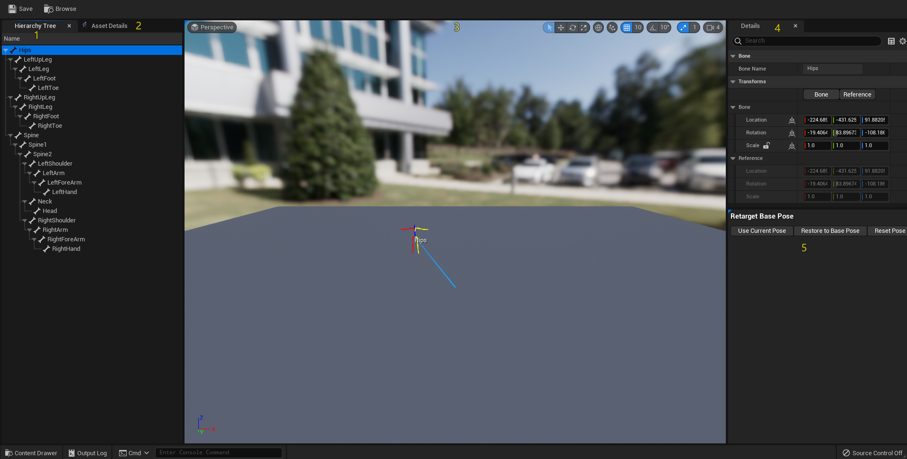

####1. Hierarchy Tree Tab

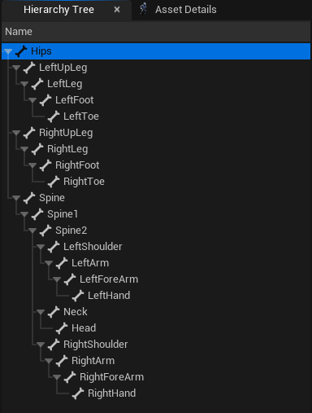

####2. Asset Details

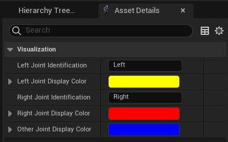

Property | Description
------------ | -------------
Left Joint Identification List| Left Joint Identification List 
Flag| The identifier in the joint name
Type| Identification type: 1. Prefix 2. Suffix 3. Contain 
Left Joint Display Color | The color displayed for the left joint
Right Joint Identification List| Right Joint Identification List
Flag| The identifier in the joint name
Type| Identification type: 1. Prefix 2. Suffix 3. Contain 
Right Joint Display Color | The color displayed for the right joint
Other Joint Display Color | The color displayed for other joints

(Note: Multiple elements are allowed in the identification list. If the joint name meets any of these conditions, it is judged as 'TRUE'.)

####3. Viewport Tab

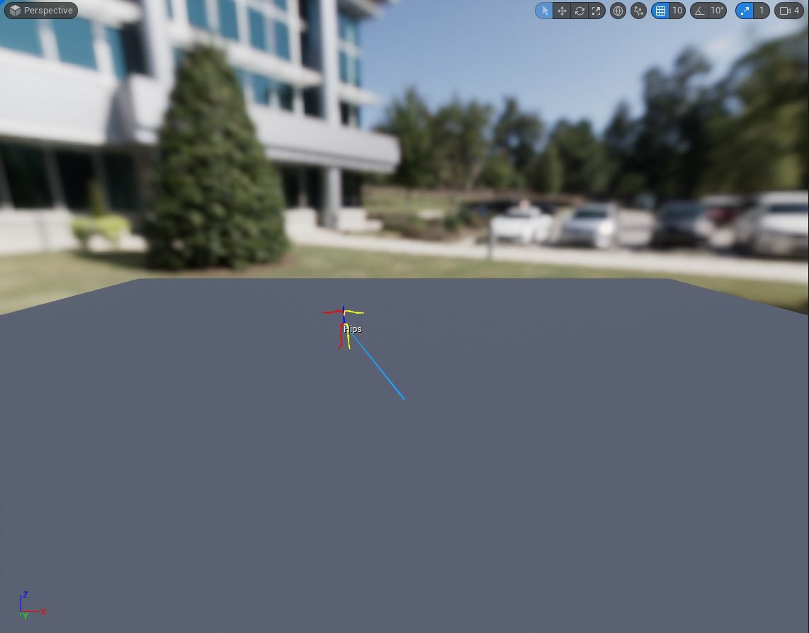

####4. Details Tab

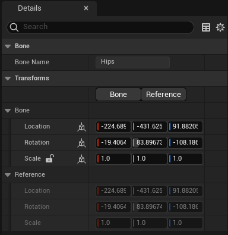

####5. Retarget Base Pose Tab

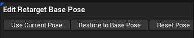

Control | Description
------------ | -------------
Use Current Pose | Write the pose in the viewport to *Retarget Base Pose* 
Restore to Base Pose | Restore *Retarget Base Pose* to a viewport
Reset Pose | Write the reference pose to *Target Base Pose*

###Motion Data Editor

    Support preview of Motion Data.
    
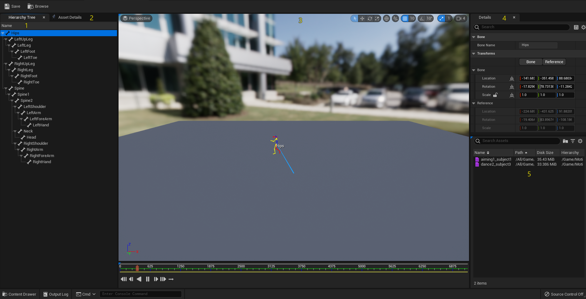

####1. Hierarchy Tree Tab

####2. Asset Details Tab

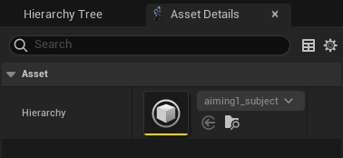

####3. Viewport Tab

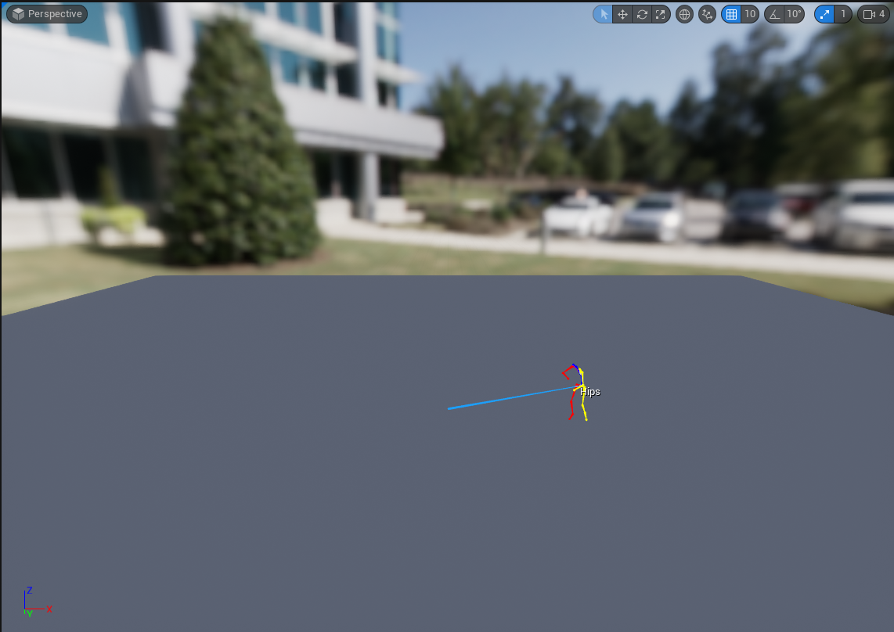

####4. Player Controller Tab

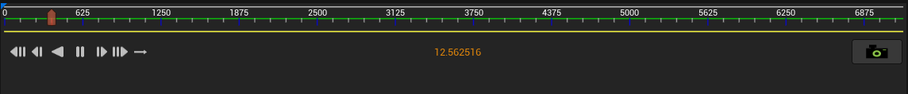

Zoom can be done through the scroll wheel
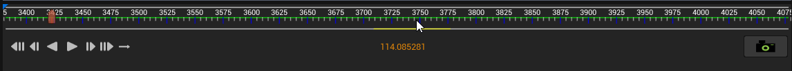

Right click drag to pan the timeline left and right
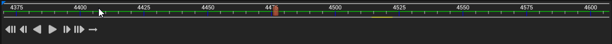

####5. Details Tab

####6. Motion Data Browser Tab

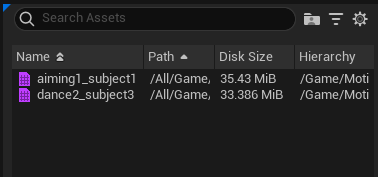

###Motion Hierarchy Retargetable Editor

    Support preview and editing of Motion Hierarchy Retargetable. 
    
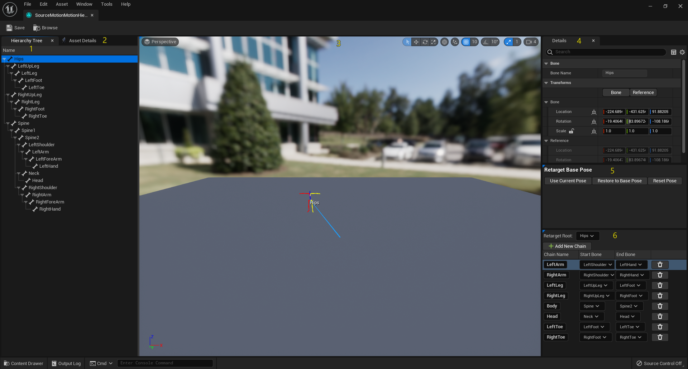

####1. Hierarchy Tree Tab

####2. Asset Details Tab

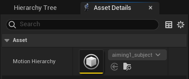

####3. Viewport Tab

####4. Details Tab

####5. Edit Retarget Base Pose Tab

Control | Description
------------ | -------------
Use Current Pose | Write the pose in the viewport to *Retarget Base Pose* 
Restore to Base Pose | Restore *Retarget Base Pose* to a viewport
Reset Pose | Write the reference pose to *Target Base Pose*

####6. Retarget Chains Tab

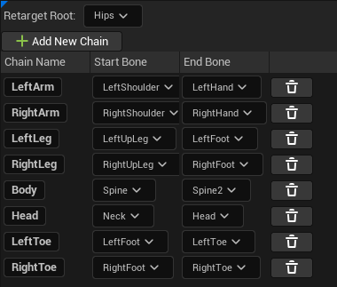

Allow copy and paste

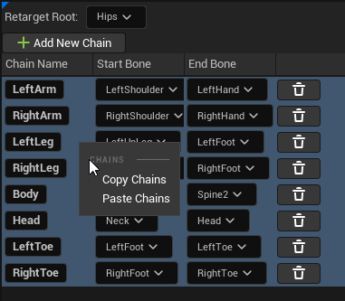

###Skeleton Hierarchy Editor

    Supports preview and editing of Skeleton Hierarchy.
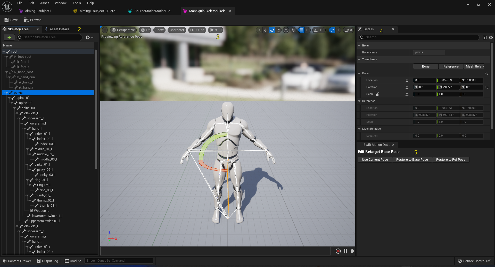

####1. Hierarchy Tree Tab

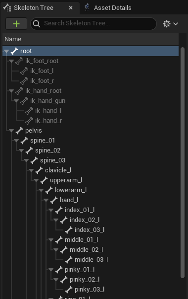

####2. Asset Details

Property | Description
------------ | -------------
Left Joint Identification List| Left Joint Identification List 
Flag| Left Joint Identification List 
Type| Identification type: 1. Prefix 2. Suffix 3. Contain 
Left Joint Display Color | The color displayed for the left joint
Right Joint Identification List| Right Joint Identification List
Flag| The identifier in the joint name
Type| Identification type: 1. Prefix 2. Suffix 3. Contain 
Right Joint Display Color | The color displayed for the right joint
Other Joint Display Color | The color displayed for other joints

(Note: Multiple elements are allowed in the identification list. If the joint name meets any of these conditions, it is judged as 'TRUE'.)

####3. Viewport Tab

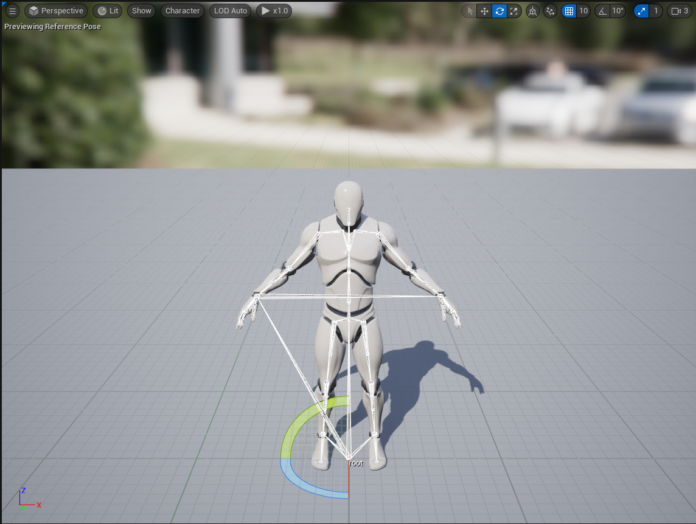

####4. Details Tab

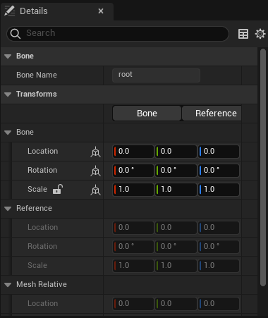

####5. Retarget Base Pose Tab

Control | Description
------------ | -------------
Use Current Pose | Write the pose in the viewport to *Retarget Base Pose* 
Restore to Base Pose | Restore *Retarget Base Pose* to a viewport
Reset Pose | Write the reference pose to *Target Base Pose*

###Skeleton Hierarchy Retargetable Editor

    Support for preview and editing of Skeleton Hierarchy Retargetable.
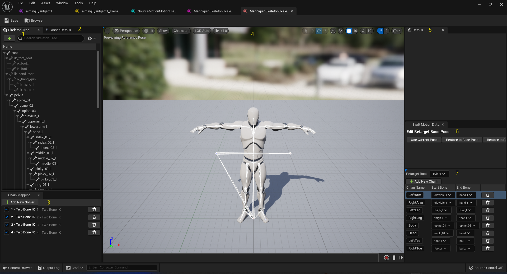

####1. Hierarchy Tree Tab

####2. Asset Details Tab

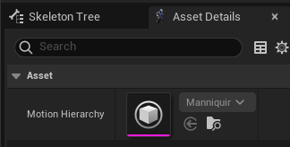

####3. IK Settings Tab

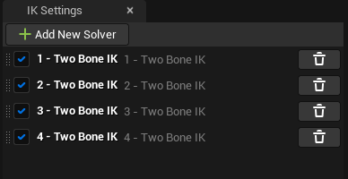

Control | Control | Description
------------ | ------------ | -------------
1 | Add New Solver | Add New Solver 
2 | Check box | Enable/Disable solver
3 | Trash can icon button | Delete corresponding solver

(Note: Select any solver , and its configuration interface will be displayed in the Details tab.)

####4. Viewport Tab

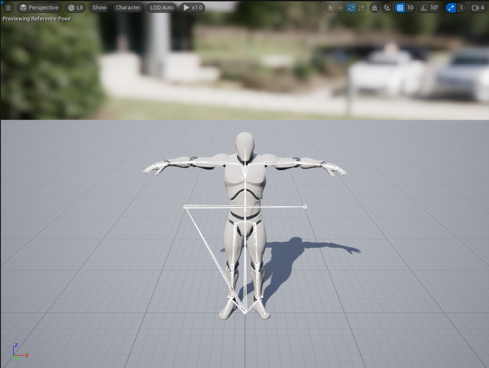

####5. Details Tab

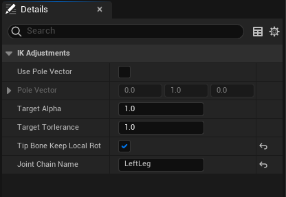

Property | Description
------------ | -------------
Use Pole Vector| Whether to use pole vector 
Pole Vector| Pole Vector 
Target Alpha| Target application level 
Target Alpha| Target tolerance amount
Tip Bone Keep Local Rot| Whether the end node keeps the rotation of the Local space after applying IK, or keeps the rotation of the Global space before applying IK
Joint Chain Name| Bone chain name 

####6. Edit Retarget Base Pose Tab

Control | Description
------------ | -------------
Use Current Pose | Write the pose in the viewport to *Retarget Base Pose* 
Restore to Base Pose | Restore *Retarget Base Pose* to a viewport
Reset Pose | Write the reference pose to *Target Base Pose*

####7. Retarget Chains Tab

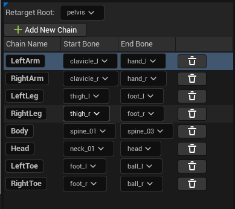

Allow copy and paste

###Motion to AnimSeq Retargeter Editor

    Supports retarget settings between source and target and preview of results.
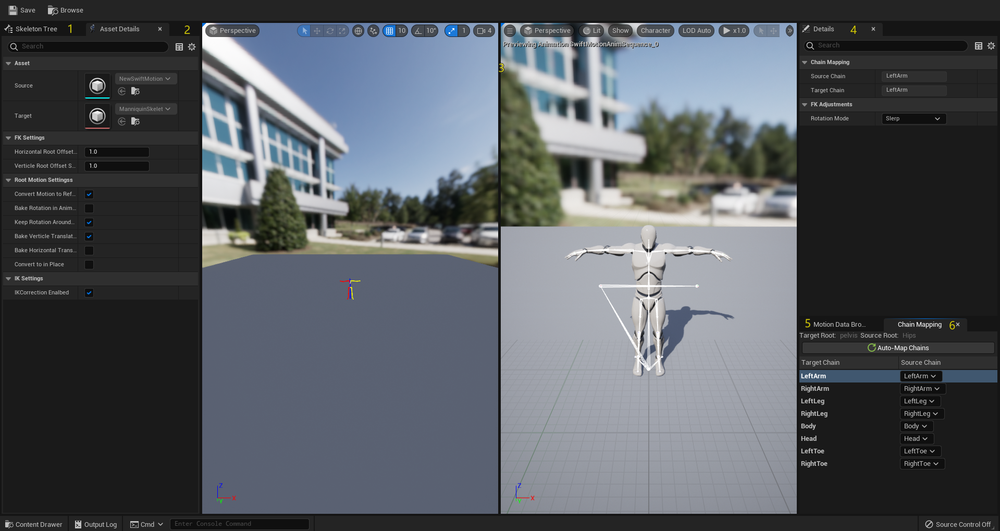

####1. Hierarchy Tree Tab

####2. Asset Details Tab

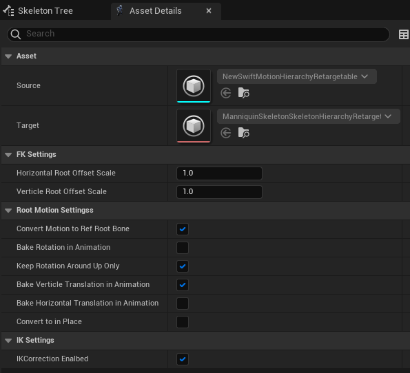

Property | Description
------------ | -------------
Source| Source Retargetable 
Target| Target Retargetable 
Horizontal Root Offset Scale| Root offset scaling in the horizontal direction 
Verticle Root Offset Scale| Root offset scaling in the vertical direction
Convert Motion To Root Bone| Set motion to root bone
Bake Root Rotation in Animation| Bake the rotation of the root node to the animation
Keep Root Rotation Around Up Only| Keep Root only around the rotation in the upward direction
Bake Root Verticle Translation in Animation| Bake the vertical displacement of the root node to the animation 
Bake Horizontal Translation in Animation| Bake the horizontal displacement of the root node to the animation 
Convert to In Place Animation| Whether to convert to in-place animation 
IKCorrection Enalbe| Whether to enable IK 

####3. Source Viewport Tab & Target_Viewport Tab

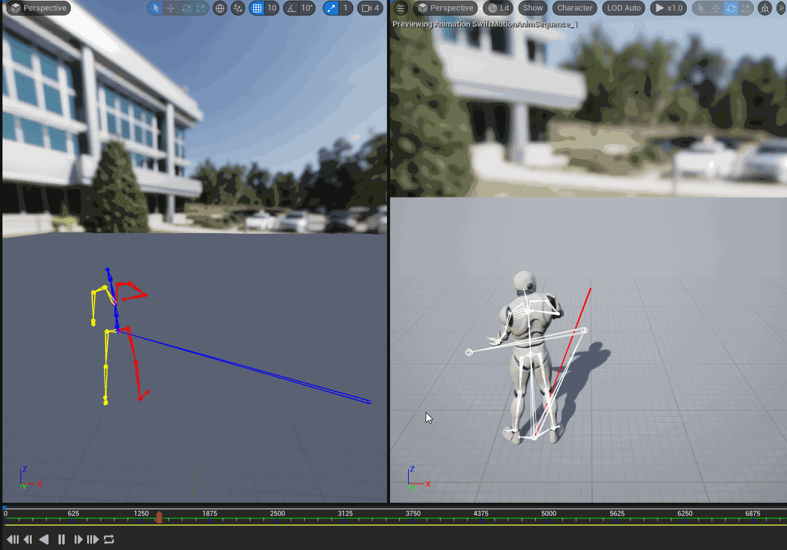

####4. Player Controller Tab

Zoom with scroll wheel

Right-click and drag to pan the timeline left and right

####5. Details Tab

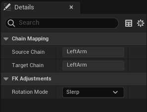

Property | Description
------------ | -------------
Source Chain| Source bone chain
Target Chain| Target joint chain
Rotation Mode| Select the mode for establishing the mapping relationship between the source and target chains.

####6. Motion Data Browser Tab

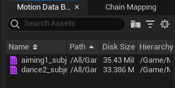

####7. Chain Mapping Tab

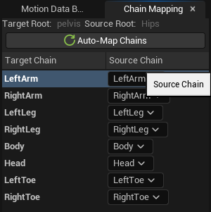

Control | Description
------------ | -------------
Auto-Map Chains | Attempt to automatically pair by name.
Drop-down menu in the Source Chain column | Manually select the source joint chain

##Quick Start

In this quick start guide we will show you how to import a mo-cap file saved in bvh format into Unreal Engine Editor and retarget it to skeletal animation of an existing character. It also shows how to convert animations between two characters with different bone hierarchies, such as retargeting animations downloaded from the mixamo.com website to standard Unreal Engine skinned characters. For more detailed use, please refer to the [Video Tutorials](#video-tutorials)

####Enable plugin
Download and make sure to enable the plugin in the editor.

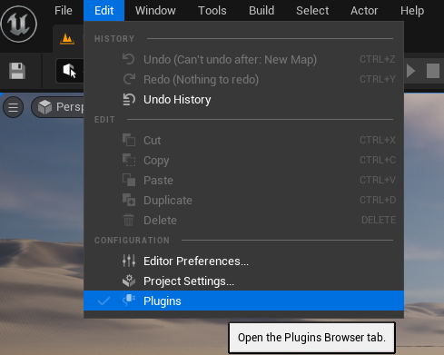

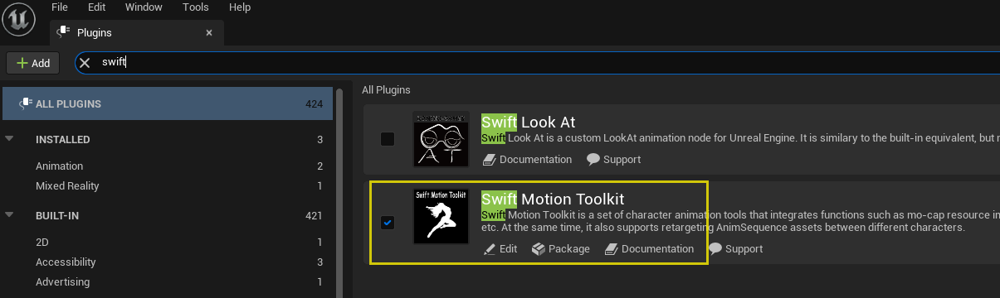

### Retarget mo-cap to AnimSequence asset
####Import motion capture resources

Drag and drop the Mocap resource file in bvh format to the Content Browser of Unreal Engine.

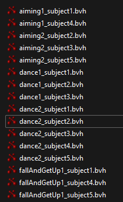

You can choose to import Hierarchy assets only or Motion Data assets as well. If you need to import a Motion Data asset, you must select a compatible Hierarchy asset. You can check to import Hierarchy assets or select existing Hierarchy assets. 

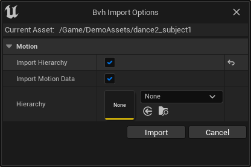

If you choose to import both, the result is shown in the image below:

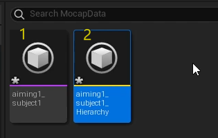

(1) is [Motion Data](#motion-data), (2) is [Motion Hierarchy](#motion-hierarchy)

Assets can be double-clicked to open them for viewing in the [Motion Data Editor](#motion-data-editor) and [Motion Hierarchy Editor](#motion-hierarchy-editor) respectively.

####Adjust the Base Retarget Pose in the Motion Hierarchy asset to TPose
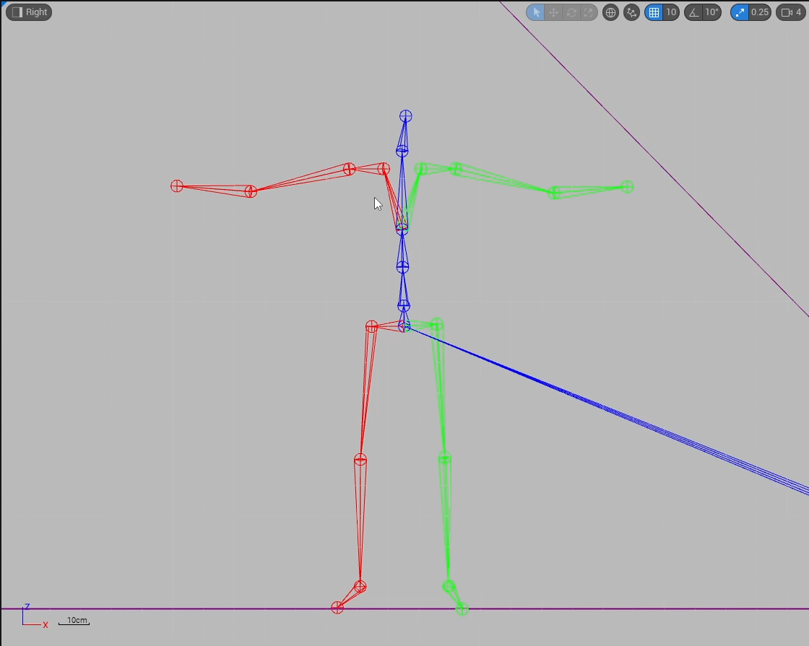

Before

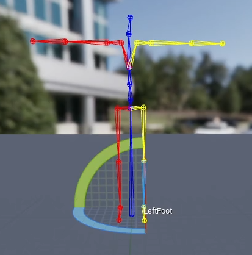

After

In the *Edit Retarget Base Pose* panel:

* Click the *Use Current Pose* button to set the pose in the viewport to the *Retarget Base Pose* used by the *Retargetable* asset.
* Click the *Restore to Base Pose* button to restore the pose in the viewport to *Retarget Base Pose*.
* Click the *Reset Pose* button to reset the pose in the viewport to the *Retarget Base Pose* used by the *Hierarchy* asset that the *Retargetable* depends on.

####Create the Motion Hierarchy Retargetable asset

by selecting the Motion Hierarchy Retargetable option in the Swift Motion Toolkit category of the Content Browser context menu.

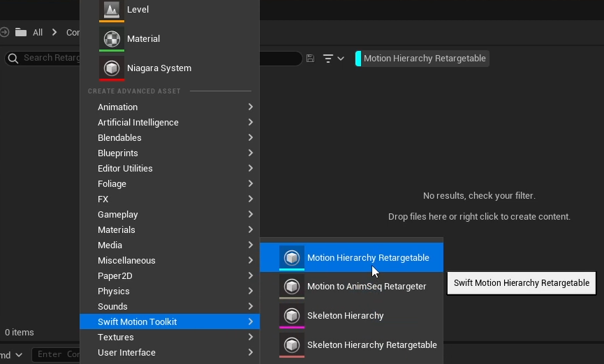

In the popup select the Motion Hierarchy asset as the retarget source.

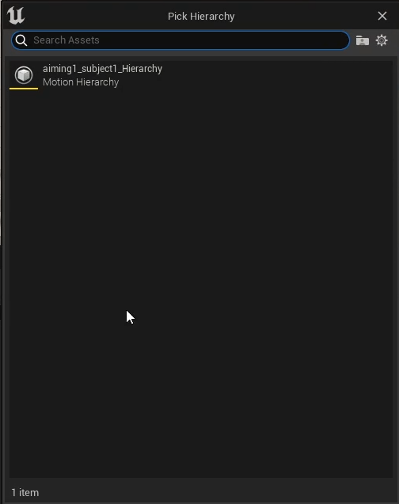

The following is the [Motion Hierarchy Retargetable](#motion-hierarchy-retargetable) asset created:

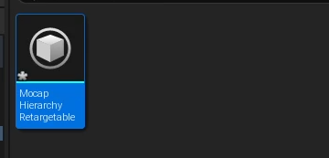

Double-click an asset to open the corresponding editor:

In the *Joint Chain Settings* panel, the *Joint Chain* and the *Retargetable Root Bone* for the current *Retargetable* can be defined.

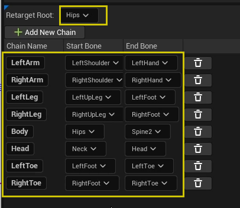

####Create the Skeleton Hierarchy asset.

Via selecting the Skeleton Hierarchy option in the Swift Motion Toolkit category of the Content Browser context menu.

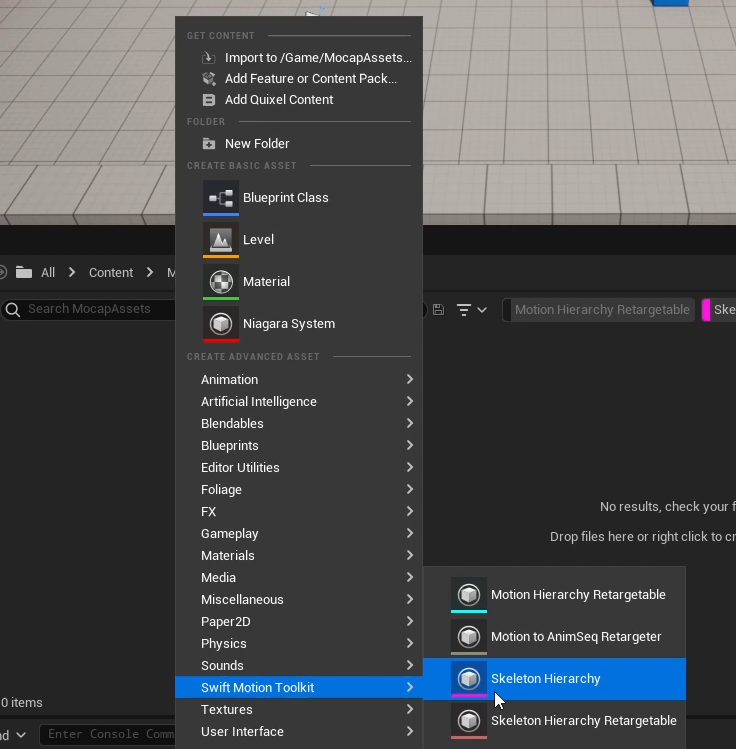

Select the Skeletal Mesh asset in the popup .

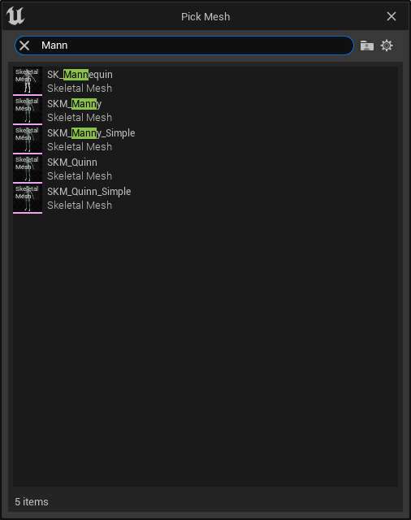

The [Skeleton Hierarchy](#skeleton-hierarchy) asset created is as follows :

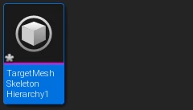

Double-click an asset to open the corresponding editor:

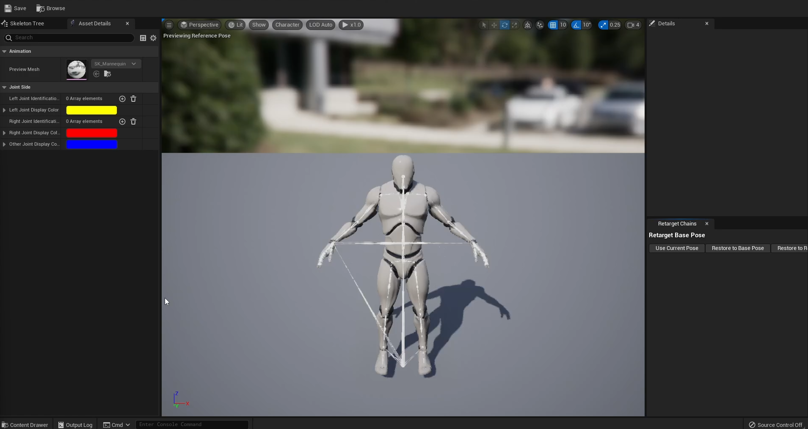

Edit *Retarget Base Pose* in the viewport (recommend adjusting it to T Pose).

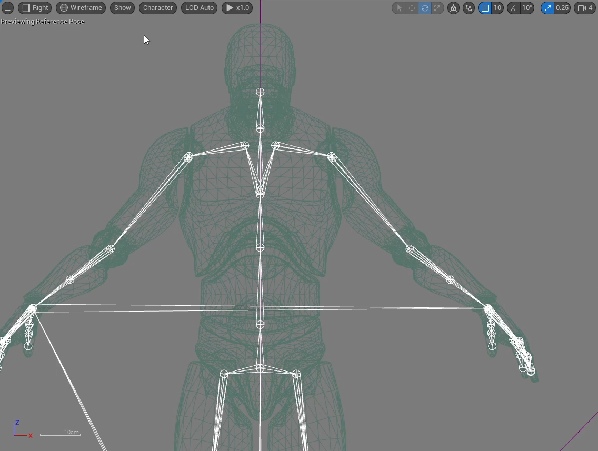
Before

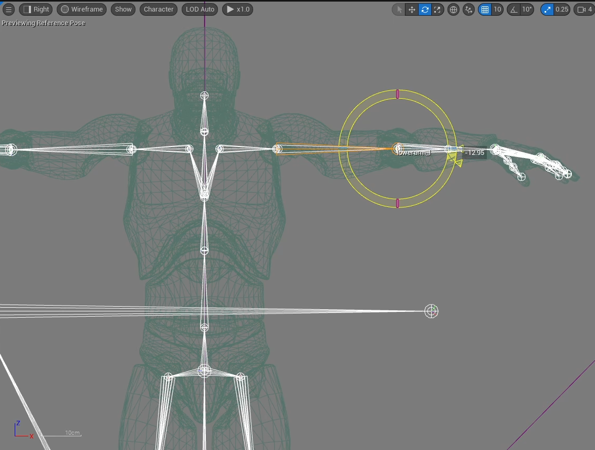
After

In the *Edit Retarget Base Pose* panel:

* Click the *Use Current Pose* button to set the pose in the viewport to the *Retarget Base Pose* used by the *Retargetable* asset.
* Click the *Restore to Base Pose* button to restore the pose in the viewport to *Retarget Base Pose*.
* Click the *Reset Pose* button to reset the pose in the viewport to the *Retarget Base Pose* used by the *Hierarchy* asset that the *Retargetable* depends on.

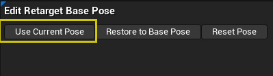

####Create the Skeleton Hierarchy Retargetable asset.

Via selecting the Skeleton Hierarchy Retargetable option in the Swift Motion Toolkit category of the Content Browser context menu.

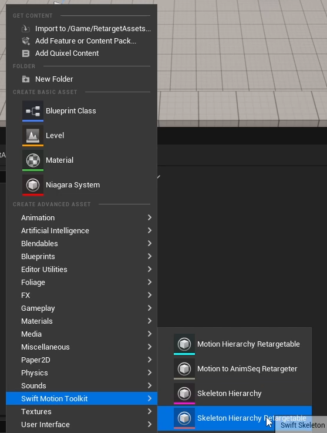

Select the Skeleton Hierarchy asset in the popup .

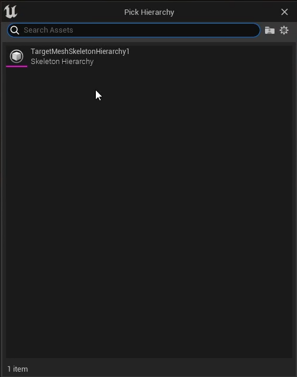

The following is the created [Skeleton Hierarchy Retargetable](#skeleton-hierarchy-retargetable) asset:

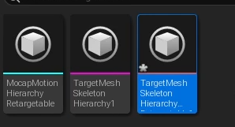

Double-click an asset to open the corresponding editor:

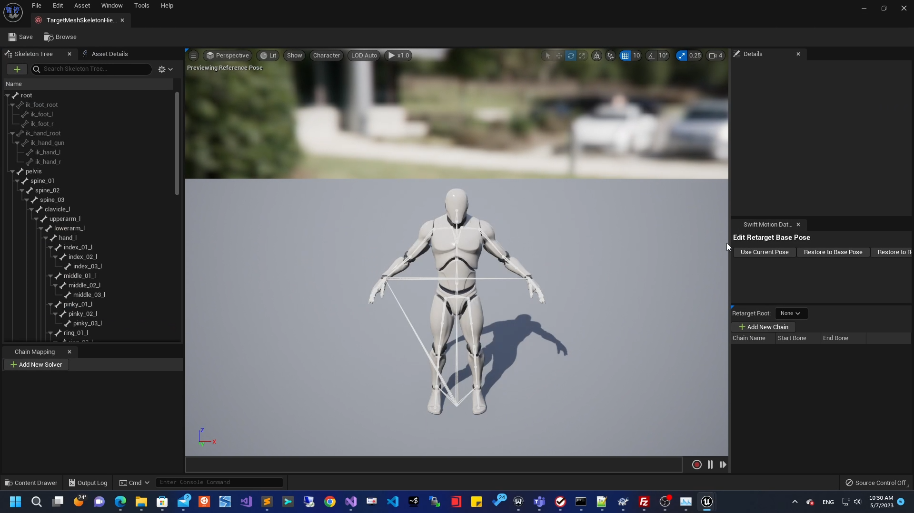

In the *Joint Chain Settings* panel, it is possible to define the *Joint Chain* and the *Retargetable Root Bone* for the current *Retargetable*.

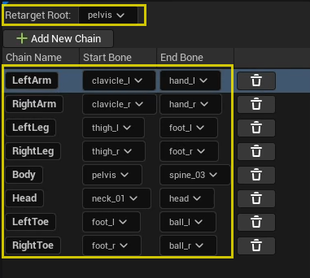

####Create Motion to AnimSeq Retargeter

By selecting Motion to AnimSeq from the Swift Motion Toolkit category in the Content Browser context menu The Retargeter option creates corresponding assets.

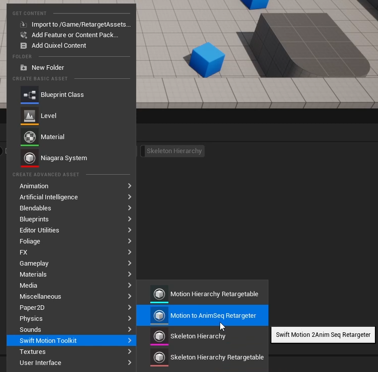

In the pop-up window select the Motion Hierarchy Retargetable asset for the source and the Skeleton Hierarchy Retargetable asset for the target respectively.

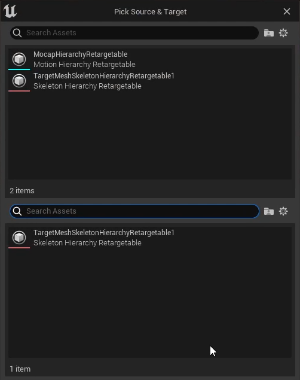

The [Motion to AnimSeq](#motion-to-animseq-retargeter) created is as follows Retargeter assets:

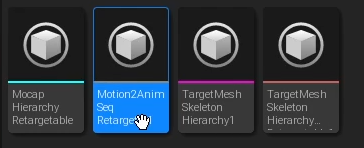

Double-click an asset to open the corresponding editor:

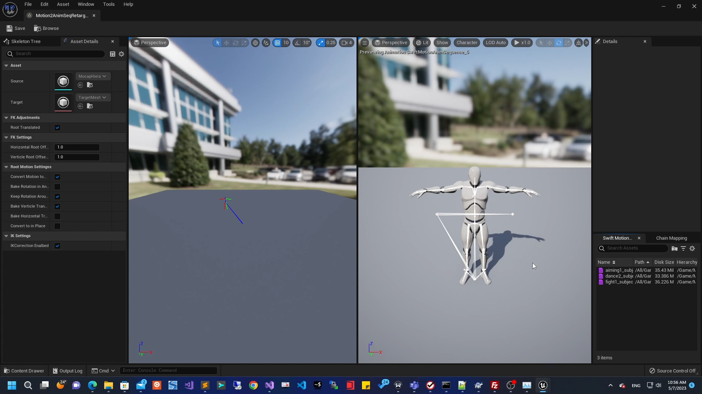

In the *Chain Mapping* panel, we can set the mapping relationship between the retarget source and target *Joint Chains*.

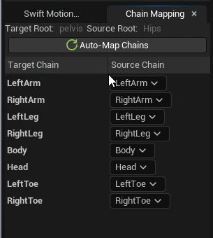

Then double-click on the asset in the *Motion Data Browser* to preview the retargeting result in the viewport.

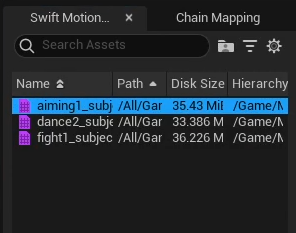

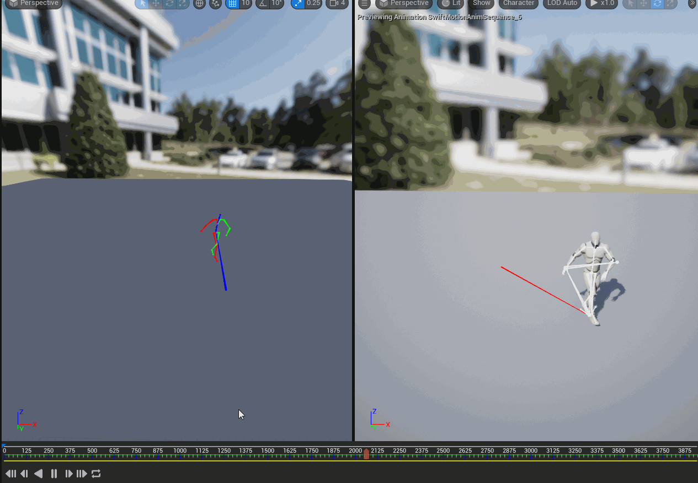

###Retarget between AnimSequence assets

for using an *AnimSequence* asset as a retarget source is similar to using a Mocap asset as a retarget source. We first need to create a *Hierarchy* asset and a *Hierarchy Retargetable* asset based on the *Skeletal Mesh* asset of the retarget source. Then use the *Retargeter* asset to create a mapping between the two for retarget. Converted assets can be used out of the box in *Unreal Engine* because our tool does proper handling of root joints and IK joints.

####Source animation download from mixamo.com

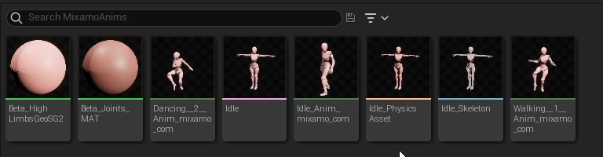

####Create the Skeleton Hierarchy asset for the source animation.

Via selecting the Skeleton Hierarchy option in the Swift Motion Toolkit category of the Content Browser context menu.

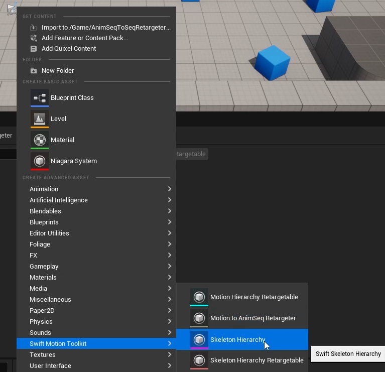

In the popup select the Skeletal Mesh asset as the retarget source.

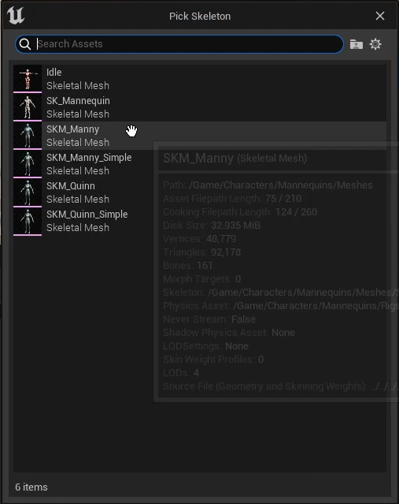

The Skeleton Hierarchy asset created is as follows :

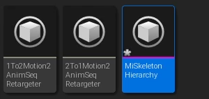

Double-click an asset to open the corresponding editor:

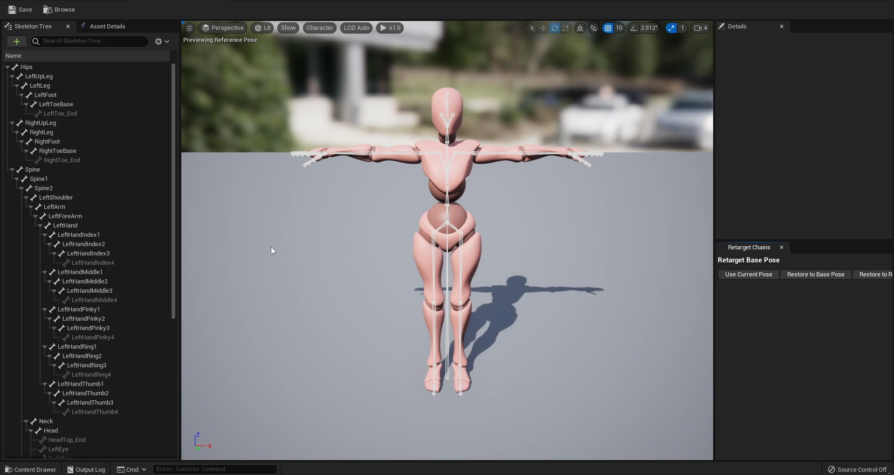

In the *Edit Retarget Base Pose* panel:

* Click the *Use Current Pose* button to set the pose in the viewport to the *Retarget Base Pose* used by the *Retargetable* asset.
* Click the *Restore to Base Pose* button to restore the pose in the viewport to *Retarget Base Pose*.
* Click the *Reset Pose* button to reset the pose in the viewport to the *Retarget Base Pose* used by the *Hierarchy* asset that the *Retargetable* depends on.

####Create the Skeleton Hierarchy Retargetable asset for the source animation.

Via selecting the Skeleton Hierarchy Retargetable option in the Swift Motion Toolkit category of the Content Browser context menu.

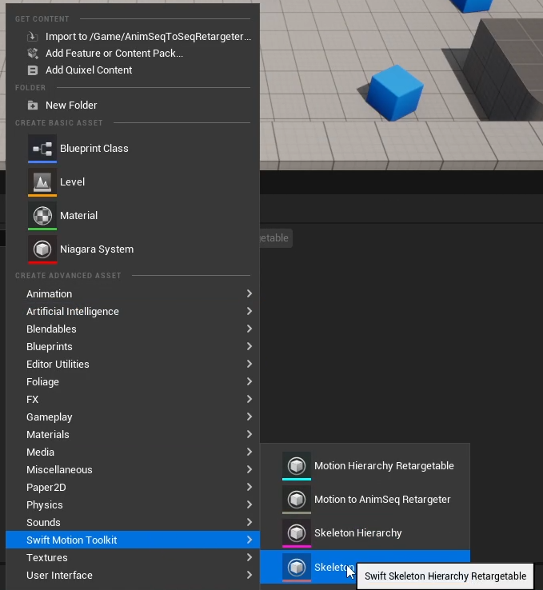

Select the Skeleton Hierarchy asset in the popup .

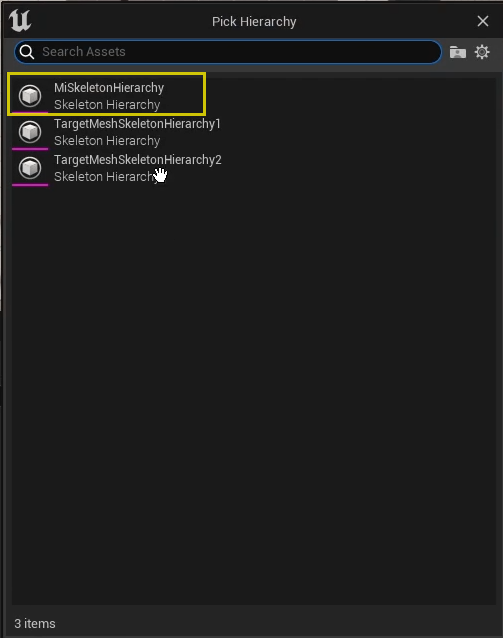

The following is the created Skeleton Hierarchy Retargetable asset:

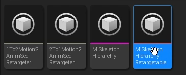

Double-click an asset to open the corresponding editor:

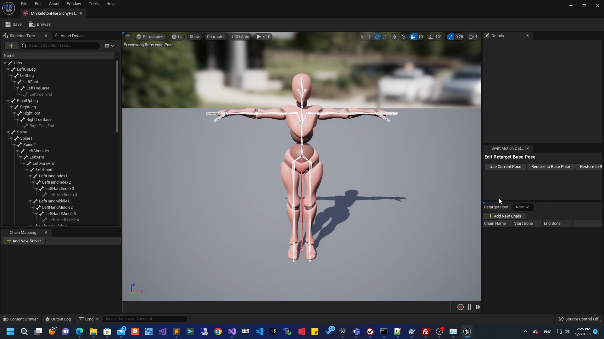

Because there is already a fully consistent Joint Chains definition in other *Retargetable*, we can copy it from there. (Even if it is not consistent, it can be copied. Our tool will ignore the Joint Chains that do not match the *Hierarchy* correctly.)

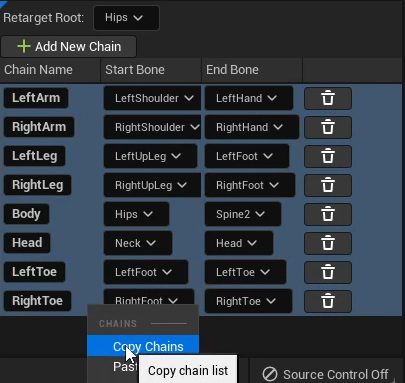
Copy

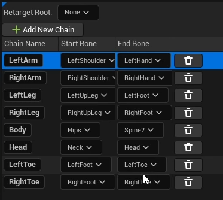
Paste

Set retarget root bone

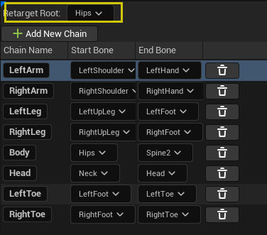

####Create Motion to AnimSeq Retargeter(reuse the previously created Target Skeleton Hierarchy Retargetable)

Via selecting Motion to AnimSeq from the Swift Motion Toolkit category in the Content Browser context menu The Retargeter option creates corresponding assets.

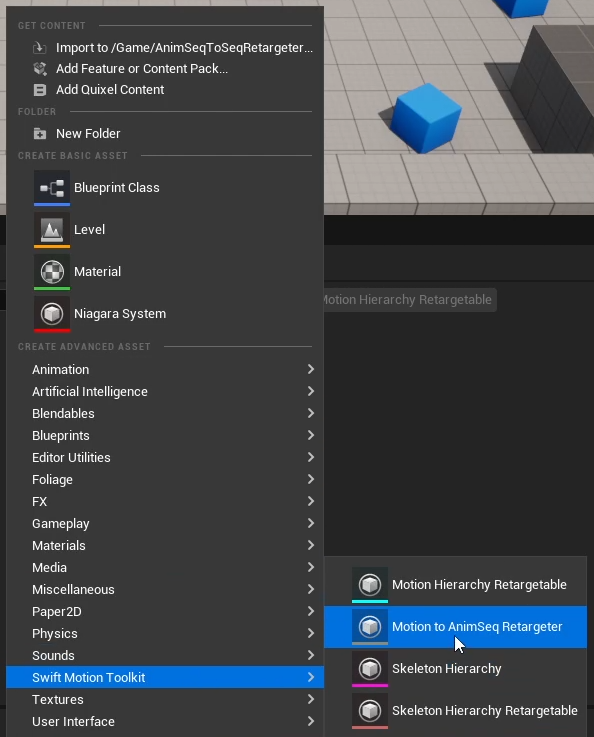

In the pop-up window select the Motion Hierarchy Retargetable asset for the source and the Skeleton Hierarchy Retargetable asset for the target respectively.

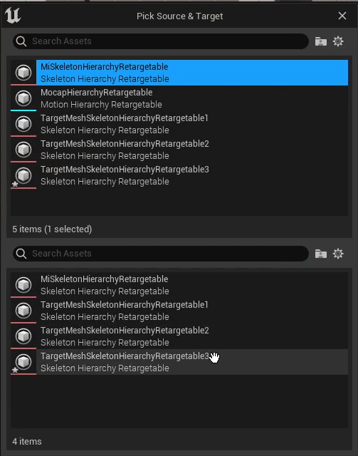

The Motion to AnimSeq created is as follows Retargeter assets:

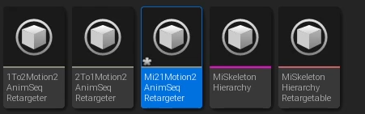

Double-click an asset to open the corresponding editor:

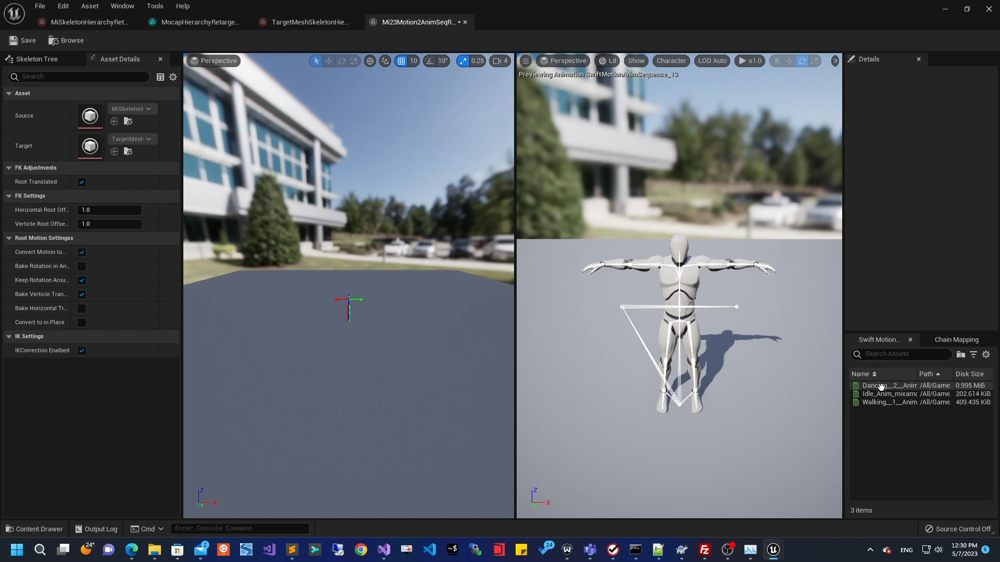

In the *Chain Mapping* panel, we can set the mapping relationship between the source and target *Joint Chains*.

Then double-click on the asset in the *Motion Data Browser* to preview the retargeting result in the viewport.

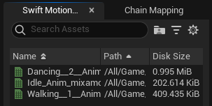

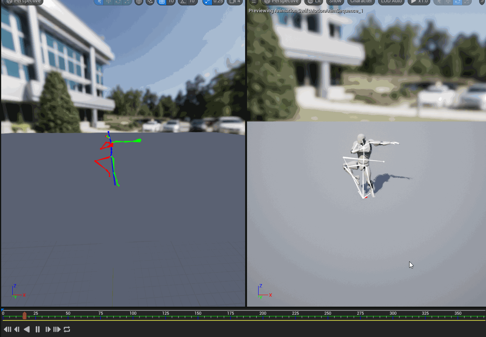

