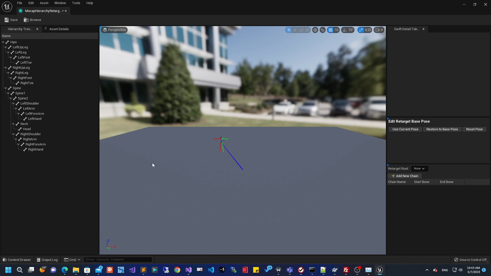
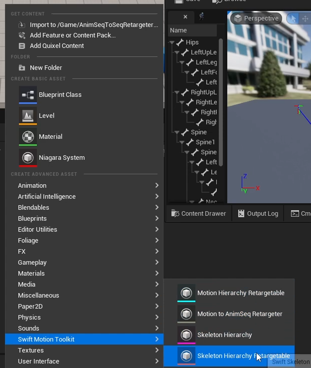
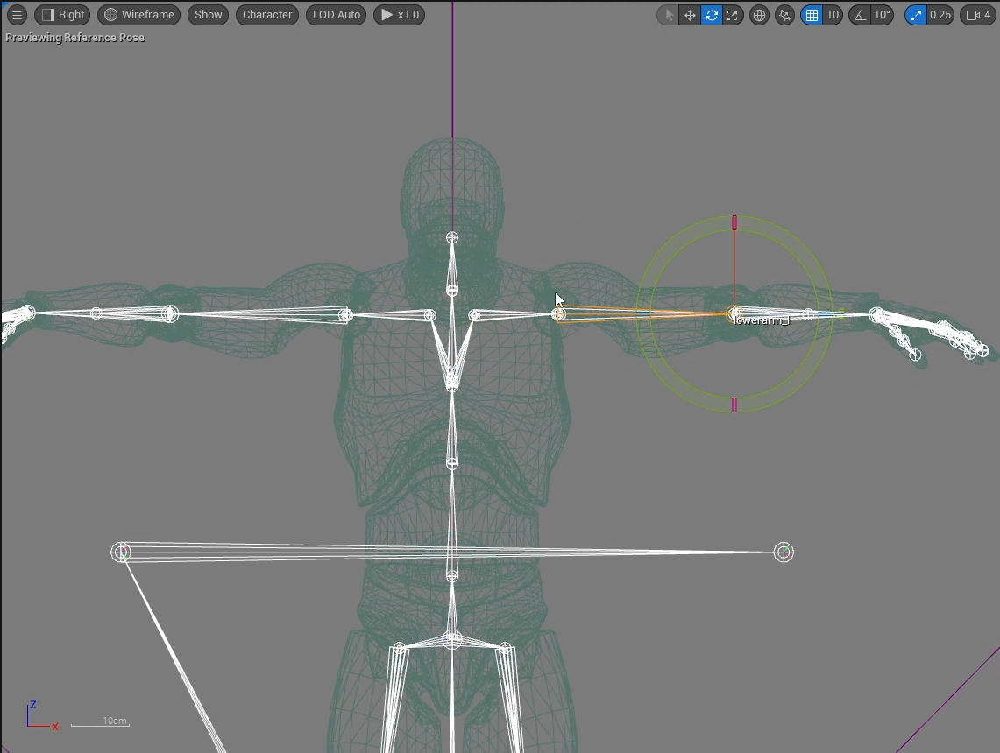
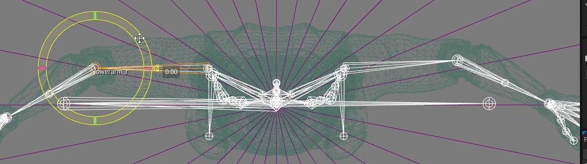
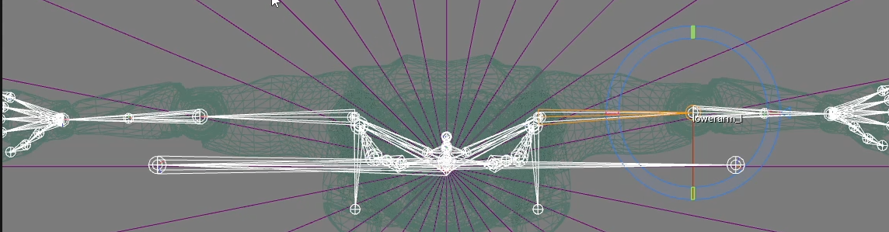
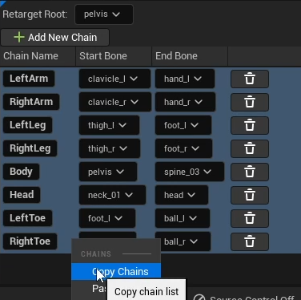
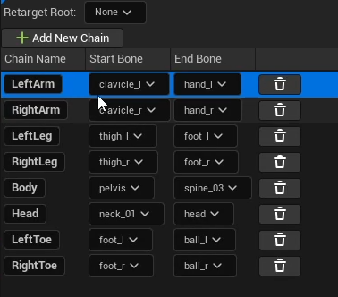
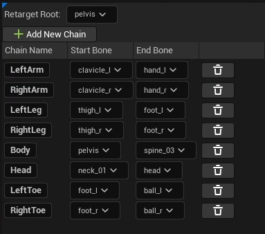

#Welcome to Swift Motion Toolkit Manual

##Overview

*Swift Motion Toolkit* 是一套集成Mocap资源导入、动画重定向和 Root Motion 处理等功能于一体的角色动画工具。同时它也支持不同角色 AnimSequence 动画资产之间的重定向。

##Features

* 导入BVH格式的Mocap动画，并提供预览。
* 重定向Mocap动画为AnimSequence资产。
* 重定向AnimSequence资产。
* 支持以IK的方式更精确的复原末端关节的位置。
* 支持将动画同步至IK骨骼。
* 支持将垂直或（和）水平方向的Root位移烘焙至动画。
* 支持仅保留水平方向的根旋转。
* 支持将RootMotion转为原地动画。

##Showcase

<iframe width="560" height="315" src="https://www.youtube.com/embed/G_QuKErWYU4" frameborder="0" allowfullscreen></iframe>

<iframe width="560" height="315" src="https://www.youtube.com/embed/jM3J4OttxXs" frameborder="0" allowfullscreen></iframe>

##相关资产
* Motion Hierarchy

    *Motion Hierarchy* 资产记录了Mocap动画使用的的骨架拓扑结构并包含了一个重定向基础姿势。

* Motion Data

    *Motion Data* 记录了 Mocap 动画的一系列与时间相关的姿势数据。并持有对一个 Motion Hierarchy 资产的引用。该 Motion Hierarchy 资产可以解释 Motion Data 中每个姿势的拓扑结构。

* Motion Hierarchy Retargetable

    *Motion Hierarchy Retargetable* 持有一个 *Motion Hierarchy* 资产的引用。 该资产允许用户定义若干条骨骼链用于动作重定向，并且允许用户定义新的重定向基础姿势（如果不在 *Motion Hierarchy Retargetable* 中定义重定向基础姿势，则在重定向时将使用 *Motion Hierarchy* 中的重定向基础姿势）。

* Skeleton Hierarchy

    *Skeleton Hierarchy* 持有一个 *USkeleton* 资产的引用。 该资产允许用户定义新的重定向基础姿势（如果不在 *Skeleton Hierarchy* 中定义重定向基础姿势，则在重定向时将使用 *USkeleton*  中的重定向基础姿势）。

* Skeleton Hierarchy Retargetable

    *Skeleton Hierarchy Retargetable* 持有一个 *Skeleton Hierarchy* 资产的引用。 该资产允许用户定义若干条骨骼链用于动作重定向，并且允许用户定义新的重定向基础姿势（如果不在 *Skeleton Hierarchy Retargetable* 中定义重定向基础姿势，则在重定向时将使用 *Skeleton Hierarchy* 中的重定向基础姿势）。

* Motion to AnimSeq Retargeter

    *Motion to AnimSeq Retargeter* 持有一对 *Hierarchy Retargetable* 作为重定向的源和目标。 该资产允许用户对源和目标的骨骼链映射表，和FK、IK以及Root Motion进行配置。并提供重定向结果的预览和导出。

##编辑器
* Motion Data Editor

    支持对 Motion Data 的预览。

* Motion Hierarchy Editor

    支持对 Motion Hierarchy 的预览和编辑。

* Motion Hierarchy Retargetable Editor

    支持对 Motion Hierarchy Retargetable 的预览和编辑。

* Skeleton Hierarchy Editor

    支持对 Skeleton Hierarchy 的预览和编辑。

* Skeleton Hierarchy Retargetable Editor

    支持对 Skeleton Hierarchy Retargetable 的预览和编辑。

* Motion to AnimSeq Retargeter Editor

    支持对 Motion to AnimSeq Retargeter 的预览和编辑。

##Quick Start
####开启插件

###Mocap 动画重定向至 AnimSequence资产
####导入动作捕捉资源。

将 bvh 格式的 Mocap 资源文件拖拽至 Unreal Engine 的 Content Browser 中。

可以选择仅导入 Hierarchy 资产或同时导入 Motion Data 资产。若需要导入 Motion Data 资产，则必须选择与之兼容的 Hierarchy 资产。可以勾选导入 Hierarchy 资产或选择已有 Hierarchy 资产。 

如果选择导入两者，则结果如下图所示：

####创建 Motion Hierarchy Retargetable 资产。

通过选择 Content Browser 上下文菜单 Swift Motion Toolkit 分类中 Motion Hierarchy Retargetable 选项创建对应资产。

在弹出窗口中选择作为重定向源的 Motion Hierarchy 资产。

如下为创建的 Motion Hierarchy Retargetable 资产：

双击资产可以打开对应编辑器：

在视口中编辑 *Retarget Base Pose* (建议将其调整为 T Pose)。

调整前

调整后

在 *Edit Retarget Base Pose* 面板中:

* 点击 *Use Current Pose* 按钮可以将视口中的姿势设置为 *Retargetable* 资产所使用的 *Retarget Base Pose*.
* 点击 *Restore to Base Pose* 按钮可以将视口中的姿势还原为 *Retarget Base Pose*.
* 点击 *Reset Pose* 按钮可以将视口中的姿势还原为当前 *Retargetable* 依赖的 *Hierarchy* 资产所使用的 *Retarget Base Pose*.

在 *Joint Chain Settings* 面板中，可以为当前 *Retargetable* 定义 *Joint Chain* 和 *重定向根骨骼*.

####创建 Skeleton Hierarchy 资产。

通过选择 Content Browser 上下文菜单 Swift Motion Toolkit 分类中 Skeleton Hierarchy 选项创建对应资产。

在弹出窗口中选择作为重定向目标的 Skeletal Mesh 资产。

如下为创建的 Skeleton Hierarchy 资产：

####创建 Skeleton Hierarchy Retargetable 资产。

通过选择 Content Browser 上下文菜单 Swift Motion Toolkit 分类中 Skeleton Hierarchy Retargetable 选项创建对应资产。

在弹出窗口中选择作为重定向目标的 Skeleton Hierarchy 资产。

如下为创建的 Skeleton Hierarchy Retargetable 资产：

双击资产可以打开对应编辑器：

在视口中编辑 *Retarget Base Pose* (建议将其调整为 T Pose)。

调整前

调整后

在 *Edit Retarget Base Pose* 面板中:

* 点击 *Use Current Pose* 按钮可以将视口中的姿势设置为 *Retargetable* 资产所使用的 *Retarget Base Pose*.
* 点击*Restore to Base Pose* 按钮可以将视口中的姿势还原为 *Retarget Base Pose*.
* 点击*Reset Pose* 按钮可以将视口中的姿势还原为当前 *Retargetable* 依赖的 *Hierarchy* 资产所使用的 *Retarget Base Pose*.

在 *Joint Chain Settings* 面板中，可以为当前 *Retargetable* 定义 *Joint Chain* 和 *重定向根骨骼*.

####创建 Motion to AnimSeq Retargeter

通过选择 Content Browser 上下文菜单 Swift Motion Toolkit 分类中 Motion to AnimSeq Retargeter 选项创建对应资产。

在弹出窗口中选择分别作为重定向源的 Motion Hierarchy Retargetable 和重定向目标的 Skeleton Hierarchy Retargetable 资产。

如下为创建的 Motion to AnimSeq Retargeter 资产：

双击资产可以打开对应编辑器：

在 *Chain Mapping* 面板中我们可以设置重定向源和目标的 *Joint Chains* 间的映射关系。

然后在 *Motion Data Browser* 中双击相应资产即可在视口中预览重定向结果。

###AnimSequence资产间的重定向

将 *AnimSequence* 资产作为重定向源与将 Mocap 资产作为重定向源的工作流程是类似的。我们首先需要基于重定向源的 *Skeletal Mesh* 资产创建 *Hierarchy* 资产和 *Hierarchy Retargetable* 资产。然后通过 *Retargeter* 资产为两者间建立映射关系进行重定向。因为我们的工具可以对根关节和IK关节进行合适的处理，所以转换后的资产可以在 *Unreal Engine* 中开箱即用。

####创建源动画的 Skeleton Hierarchy 资产。

通过选择 Content Browser 上下文菜单 Swift Motion Toolkit 分类中 Skeleton Hierarchy 选项创建对应资产。

在弹出窗口中选择作为重定向源的 Skeletal Mesh 资产。

如下为创建的 Skeleton Hierarchy 资产：

####创建源动画的 Skeleton Hierarchy Retargetable 资产。

通过选择 Content Browser 上下文菜单 Swift Motion Toolkit 分类中 Skeleton Hierarchy Retargetable 选项创建对应资产。

在弹出窗口中选择作为重定向目标的 Skeleton Hierarchy 资产。

如下为创建的 Skeleton Hierarchy Retargetable 资产：

双击资产可以打开对应编辑器：

在 *Edit Retarget Base Pose* 面板中:

* 点击 *Use Current Pose* 按钮可以将视口中的姿势设置为 *Retargetable* 资产所使用的 *Retarget Base Pose*.
* 点击*Restore to Base Pose* 按钮可以将视口中的姿势还原为 *Retarget Base Pose*.
* 点击*Reset Pose* 按钮可以将视口中的姿势还原为当前 *Retargetable* 依赖的 *Hierarchy* 资产所使用的 *Retarget Base Pose*.

因为其它 *Retargetable* 中已经存在完全一致的 Joint Chains 定义，所以我们可以从哪里拷贝过来.(即便不一致，也可以进行拷贝。我们的工具会忽略不能正确匹配 *Hierarchy* 的 Joint Chains.)

复制

黏贴

设置重定向根骨骼

####创建目标动画的 Skeleton Hierarchy 资产。
（复用之前创建的）
####创建目标动画的 Skeleton Hierarchy Retargetable 资产。

通过选择 Content Browser 上下文菜单 Swift Motion Toolkit 分类中 Skeleton Hierarchy Retargetable 选项创建对应资产。

在弹出窗口中选择作为重定向目标的 Skeleton Hierarchy 资产。

如下为创建的 Skeleton Hierarchy Retargetable 资产：

双击资产可以打开对应编辑器：

在视口中编辑 *Retarget Base Pose* (建议将其调整为 T Pose)。

调整前

调整后

调整前

调整后

在 *Edit Retarget Base Pose* 面板中:

* 点击 *Use Current Pose* 按钮可以将视口中的姿势设置为 *Retargetable* 资产所使用的 *Retarget Base Pose*.
* 点击*Restore to Base Pose* 按钮可以将视口中的姿势还原为 *Retarget Base Pose*.
* 点击*Reset Pose* 按钮可以将视口中的姿势还原为当前 *Retargetable* 依赖的 *Hierarchy* 资产所使用的 *Retarget Base Pose*.

因为其它 *Retargetable* 中已经存在完全一致的 Joint Chains 定义，所以我们可以从哪里拷贝过来.(即便不一致，也可以进行拷贝。我们的工具会忽略不能正确匹配 *Hierarchy* 的 Joint Chains.)

复制

黏贴

设置重定向根骨骼

####创建 Motion to AnimSeq Retargeter。

通过选择 Content Browser 上下文菜单 Swift Motion Toolkit 分类中 Motion to AnimSeq Retargeter 选项创建对应资产。

在弹出窗口中选择分别作为重定向源的 Motion Hierarchy Retargetable 和重定向目标的 Skeleton Hierarchy Retargetable 资产。

如下为创建的 Motion to AnimSeq Retargeter 资产：

双击资产可以打开对应编辑器：

在 *Chain Mapping* 面板中我们可以设置重定向源和目标的 *Joint Chains* 间的映射关系。

然后在 *Motion Data Browser* 中双击相应资产即可在视口中预览重定向结果。

##Properties
Property | Description
------------ | -------------
Bone to Modify | Name of bone to control. This is the main bone chain to modify from. 
Look at Target | Target socket to look at. Used if LookAtBone is empty. - You can use  LookAtLocation if you need offset from this point. That location will be used in their local space. 
Use Look Up Axis | Whether or not to use Look up axis 
Up Axis Locked | If useLookUpAxis is enabled, whether or not to lock the Up Axis.
Look Up Axis | If the Up Axis is used, System will try to rotate the bone around it until Forward Axis point to the desired point or be clamped.
Look at Clamp | Look at Clamp value in degrees - it will clamp the modified look at axis in a cone which aligns to the original forward axis direction.
Clamp Ratio | Clamp Ratio is the ratio of dimension in the pitch and yaw directions. 
Approximate Clamp | Approximate Clamp is only effect when Use Up Axis is enabled and Up Axis Locked is disabled. It is a trade-off between performance and precision.
Interpolated |  Whether or not interpolated.
Interpolation Speed | Change rate of the interpolated parameter.
Look at Target | Target socket to look at. Used if LookAtBone is empty. - You can use  LookAtLocation if you need offset from this point. That location will be used in their local space. 
Look at Location | Target Offset. It's in world space if LookAtBone is empty or it is based on LookAtBone or LookAtSocket in their local space
Show Bone Frame | Whether or not show the axes of the local coordinate system of Joint(Bone)
Show Original Lock at Axis | Whether or not show the orignal LookAt Axis.
Show Original Up Axis | Whether or not show the orignal Up Axis.
Show Modified Look at Axis | Whether or not show the modified LookAt Axis.
Show Modified Up Axis | Whether or not show the modified Up Axis. 
Show Clamp Cone | Whether or not show the Clamp Cone. 
Show Desired Target | Whether or not show desired target. 

